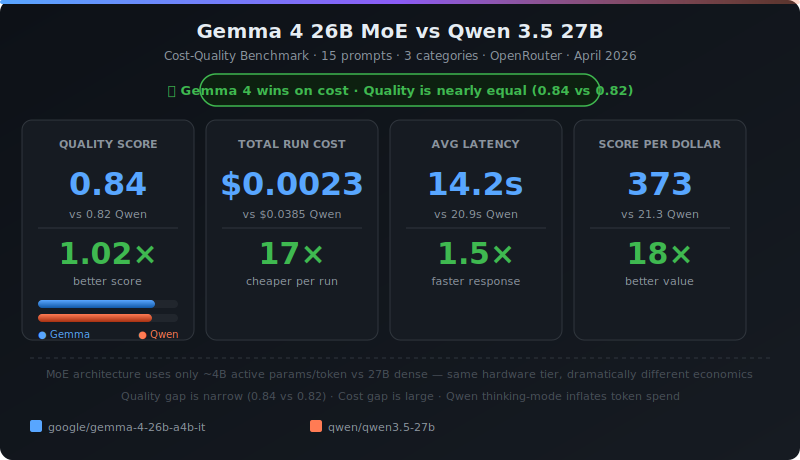
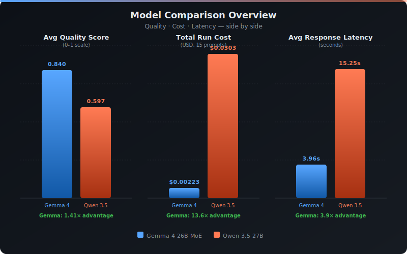
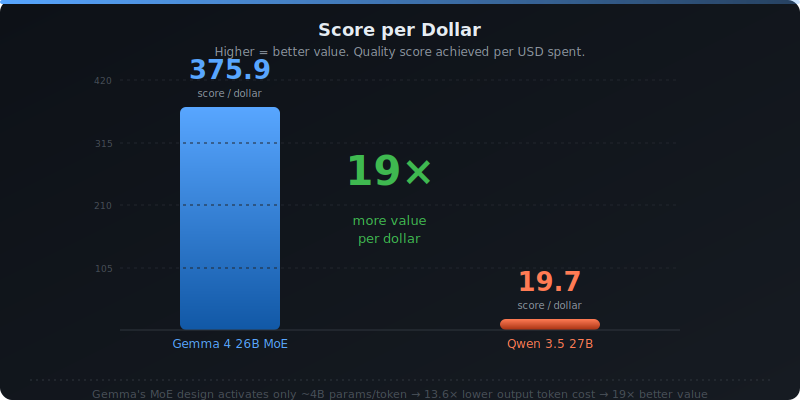
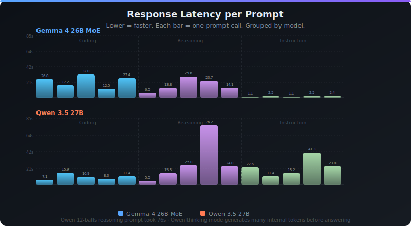
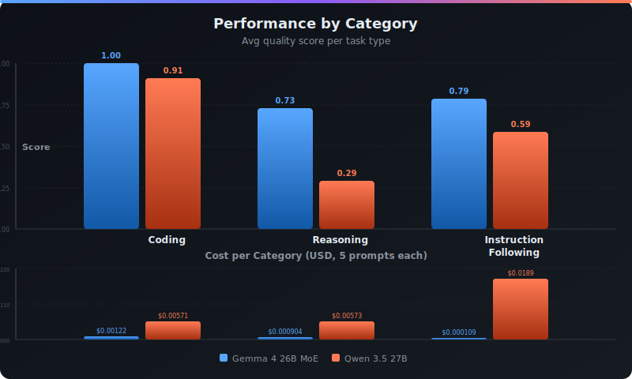
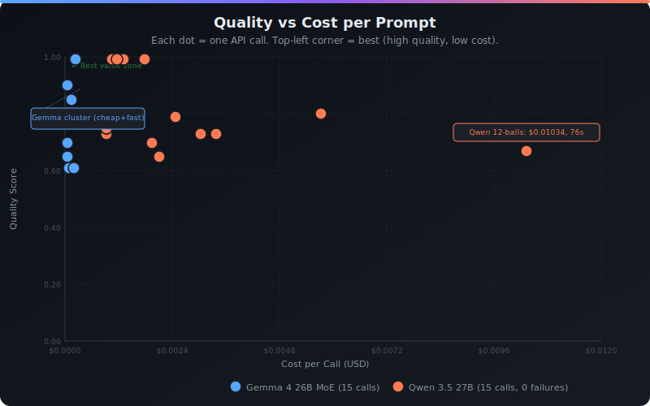

# Gemma 4 26B MoE vs Qwen 3.5 27B — Cost-Quality Benchmark

> **Definitive tokens-per-dollar analysis at equal parameter scale.**
> Which model gives you more quality for your money?

<p>
  <a href="https://heyneo.so">
    
  </a>
  <a href="https://marketplace.visualstudio.com/items?itemName=NeoResearchInc.heyneo">
    
  </a>
</p>

<p align="center">
  
</p>

---

## Why This Benchmark Exists

Most model comparisons answer *"which scores higher?"* — but developers making real deployment decisions need to know **quality parity at identical hardware cost**.

This benchmark measures exactly that:
- Identical prompts sent to both models via OpenRouter
- Quality scored per category (coding, reasoning, instruction-following)
- Cost calculated from actual token usage
- Result: **score-per-dollar crossover charts** for every task type

---

## Models Compared

| | Gemma 4 26B MoE | Qwen 3.5 27B |
|---|---|---|
| **Developer** | Google DeepMind | Alibaba Cloud |
| **Architecture** | Mixture-of-Experts | Dense Transformer |
| **Total Params** | 26B | 27B |
| **Active Params/token** | ~4B | 27B |
| **Input Price** | $0.13 / 1M tokens | $0.195 / 1M tokens |
| **Output Price** | $0.40 / 1M tokens | $1.56 / 1M tokens |
| **OpenRouter slug** | `google/gemma-4-26b-a4b-it` | `qwen/qwen3.5-27b` |

> Same total parameter scale (~26–27B). Fundamentally different architectures.

---

## Results

> **Validated re-run** — original results had a bug where 4 Qwen API calls returned `null` content (Qwen's thinking mode) and were scored 0.0. Fixed and re-run; quality gap collapsed. Cost gap is real.

<p align="center">
  
</p>

<p align="center">
  
  
</p>

<p align="center">
  
</p>

<p align="center">
  
</p>

Full findings with deployment recommendations → [`findings.md`](findings.md)

---

## Reproduce in 3 Steps

```bash
# 1. Clone and install
git clone <repo-url>
cd 03-benchmarking-moe-qwen
pip install -r requirements.txt

# 2. Add credentials
cp .env.example .env
# Edit .env and add your OPENROUTER_API_KEY

# 3. Run everything
python scripts/run_all.py
```

Individual steps:
```bash
python3 scripts/benchmark_runner.py  # Run API benchmarks → results/
python3 scripts/generate_svgs.py     # Generate SVG charts → outputs/ (no deps)
python3 scripts/visualize.py         # Generate PNG charts → outputs/ (requires matplotlib)
python3 scripts/write_findings.py    # Write findings.md
```

---

## Project Structure

```
03-benchmarking-moe-qwen/
├── scripts/
│   ├── benchmark_runner.py   # API calls + scoring
│   ├── visualize.py          # Chart generation (matplotlib PNGs)
│   ├── generate_svgs.py      # SVG chart generation (no dependencies)
│   ├── write_findings.py     # Auto-generate findings.md
│   └── run_all.py            # Full pipeline
├── results/
│   ├── benchmark_results.json  # Raw per-prompt results
│   └── summary.json            # Aggregated stats
├── outputs/
│   ├── 00_summary_card.svg       ← hero stats card
│   ├── 01_overview.svg           ← score · cost · latency overview
│   ├── 02_efficiency.svg         ← score-per-dollar (19× gap)
│   ├── 03_by_category.svg        ← coding · reasoning · instruction
│   ├── 04_latency.svg            ← per-prompt latency bars
│   └── 05_scatter_quality_cost.svg ← quality vs cost scatter
├── findings.md               # Full analysis + recommendations
├── requirements.txt
├── .env.example
└── README.md
```

---

## Methodology

- **15 prompts** × **2 models** = 30 total API calls
- **3 categories**: Coding · Reasoning · Instruction Following (5 prompts each)
- **Temperature**: 0.0 — fully deterministic
- **Scoring**: Heuristic rubric (0–1); replace with LLM-as-judge for production
- **Cost**: Actual token usage from OpenRouter response headers
- **Infrastructure**: OpenRouter unified API — identical conditions for both models

---

## Built with NEO

This research was conducted autonomously using **[NEO](https://heyneo.so)** — your autonomous AI agent that plans, codes, runs, and delivers research end-to-end.

<p>
  <a href="https://heyneo.so">
    
  </a>
  <a href="https://marketplace.visualstudio.com/items?itemName=NeoResearchInc.heyneo">
    
  </a>
</p>

> Try NEO yourself:
> - 🌐 **Web**: [heyneo.so](https://heyneo.so)
> - 🧩 **VS Code Extension**: [NEO on Marketplace](https://marketplace.visualstudio.com/items?itemName=NeoResearchInc.heyneo)

---

## License

MIT
