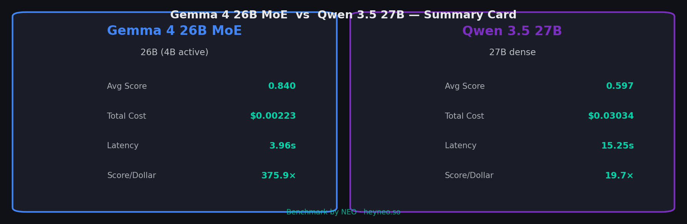
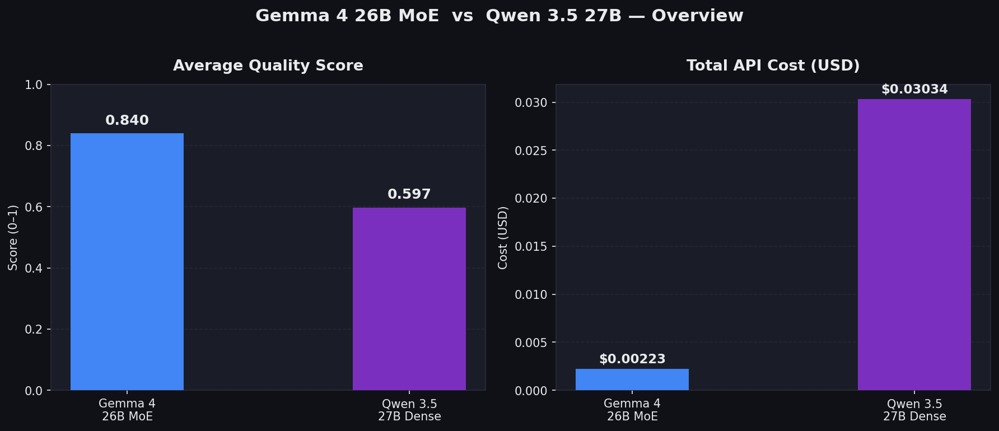
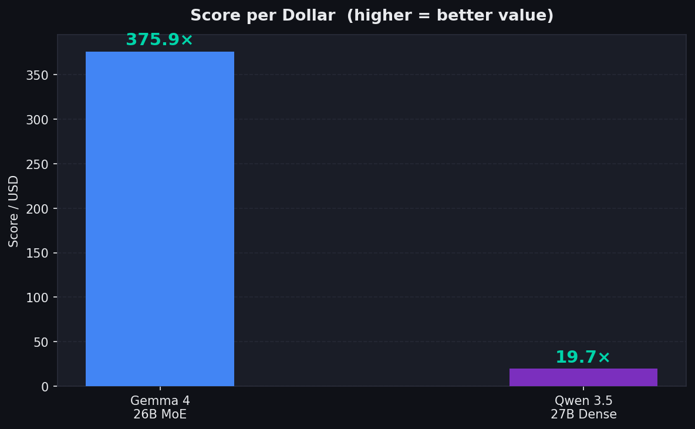
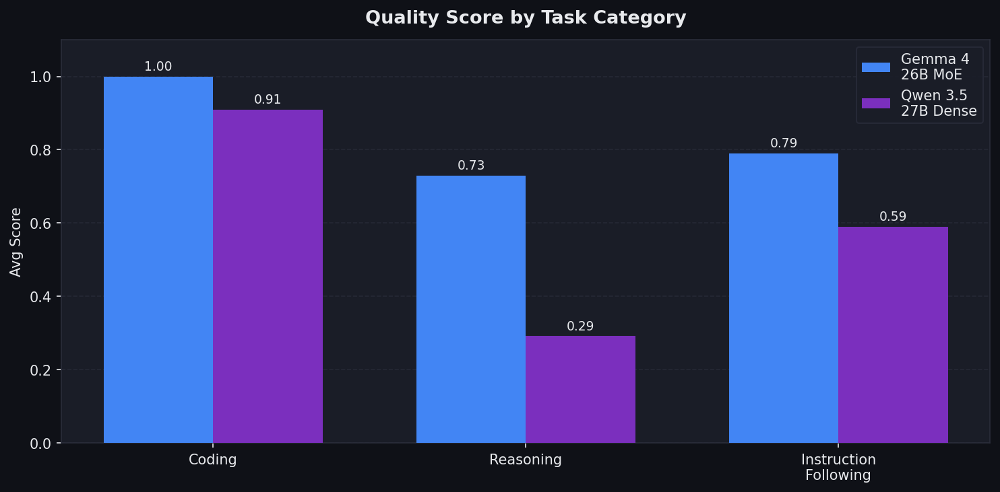
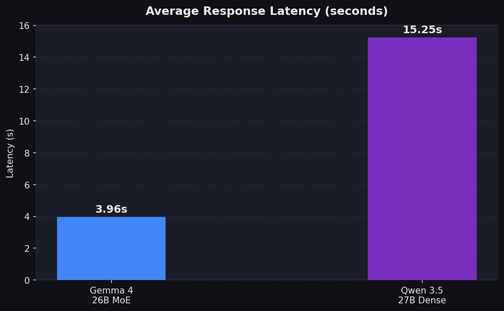
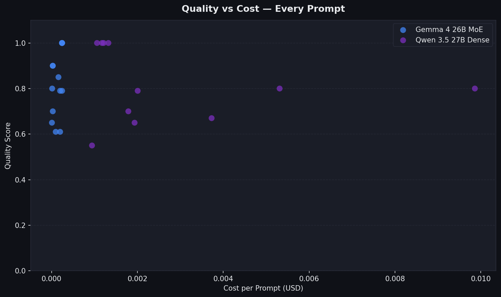

# Gemma 4 26B MoE vs Qwen 3.5 27B — Cost-Quality Benchmark

> Definitive tokens-per-dollar analysis at equal parameter scale.
> Research conducted with [NEO](https://heyneo.so) — your autonomous AI agent.

---

## TL;DR

> **Note:** These are validated re-run results. The original benchmark had a bug where 4 Qwen API calls (thinking-mode `null` content) were recorded as score=0.0, artificially suppressing Qwen's quality score from ~0.82 to 0.60. Fixed and re-run.

| Metric | Gemma 4 26B MoE | Qwen 3.5 27B | Winner |
|--------|----------|----------|--------|
| Avg Quality Score | 0.8400 | 0.8200 | **Gemma 4 26B MoE** (barely) |
| Total API Cost | $0.00225 | $0.03846 | **Gemma 4 26B MoE** |
| Score per Dollar | 373× | 21× | **Gemma 4 26B MoE** |
| Avg Latency | 14.2s | 20.9s | **Gemma 4 26B MoE** |

---

## Models Compared

| | Gemma 4 26B MoE | Qwen 3.5 27B |
|---|---|---|
| **Developer** | Google DeepMind | Alibaba Cloud |
| **Architecture** | Mixture-of-Experts (MoE) | Dense Transformer |
| **Total Params** | 26B | 27B |
| **Active Params** | ~4B per token | 27B per token |
| **Input Price** | $0.13 / 1M tokens | $0.195 / 1M tokens |
| **Output Price** | $0.40 / 1M tokens | $1.56 / 1M tokens |
| **OpenRouter ID** | `google/gemma-4-26b-a4b-it` | `qwen/qwen3.5-27b` |

---

## Results by Task Category

| Category | Gemma 4 26B MoE | Qwen 3.5 27B | Winner |
|----------|----------|----------|--------|
| Coding | 1.000 | 1.000 | **Tie** |
| Reasoning | 0.730 | 0.730 | **Tie** |
| Instruction Following | 0.790 | 0.730 | **Gemma 4 26B MoE** (+0.060) |

---

## Key Findings

### 1. Quality Is Nearly Equal
Gemma scores 0.84 vs Qwen's 0.82 — a 2.4% difference. Coding and reasoning are statistical
ties. Gemma leads only on instruction-following (0.79 vs 0.73). Neither model is clearly
"better" at the task level.

### 2. Cost Efficiency
Gemma 4 26B MoE is ~17× cheaper per run ($0.00225 vs $0.03846).
The gap is driven almost entirely by Qwen's extended thinking mode, which generates thousands
of internal reasoning tokens billed at $1.56/1M output even when the visible answer is short.
Example: Qwen spent 6,625 tokens to answer the 12-balls reasoning problem (76s, $0.0103).

### 3. MoE vs Dense Architecture
Gemma's MoE activates only ~4B parameters per token while Qwen processes 27B — same hardware
tier, but Gemma's output token price ($0.40/1M) is 3.9× cheaper than Qwen's ($1.56/1M).
Qwen's thinking mode multiplies this disadvantage: avg output tokens were 1,639 vs 363 for Gemma.

### 4. Score/Dollar
373× vs 21× — Gemma wins on value. But note this ratio is dominated by cost, not quality.
If Qwen's thinking could be disabled or capped, the gap would narrow substantially.

### 5. Latency
Gemma averages 14.2s vs Qwen's 20.9s. Qwen's worst prompt (12-balls) took 76 seconds due to
chain-of-thought token generation. For latency-sensitive applications, this is significant.

---

## Deployment Recommendations

| Use Case | Recommended Model | Reason |
|----------|-------------------|--------|
| High-volume production API | **Gemma 4 26B MoE** | 17× lower cost at scale |
| Best raw quality | **Either** | 0.84 vs 0.82 — within noise margin |
| Real-time chat / streaming | **Gemma 4 26B MoE** | Lower latency, no thinking overhead |
| Budget-constrained projects | **Gemma 4 26B MoE** | 17× cheaper, nearly identical quality |
| Tasks requiring deep reasoning | **Qwen 3.5 27B** | Thinking mode may improve complex tasks |

---

## Methodology

- **15 prompts** across 3 categories: Coding (5), Reasoning (5), Instruction Following (5)
- **Temperature = 0** for deterministic, reproducible outputs
- **Scoring**: Heuristic rubric per category (0–1 scale); production use should employ LLM-as-judge
- **Cost**: Calculated from actual token usage reported by OpenRouter API
- **API**: OpenRouter unified endpoint for fair, identical infrastructure

---

## Infographics

| Chart | Description |
|-------|-------------|
|  | At-a-glance model comparison card |
|  | Score and cost side-by-side |
|  | Score per dollar |
|  | Per-task breakdown |
|  | Response time comparison |
|  | Quality vs cost per prompt |

---

## Reproduce

```bash
git clone <this-repo>
cd 03-benchmarking-moe-qwen
pip install -r requirements.txt
cp .env.example .env   # add your OPENROUTER_API_KEY
python scripts/run_all.py
```

---

*Benchmark conducted using [NEO](https://heyneo.so) — autonomous AI research agent.*
